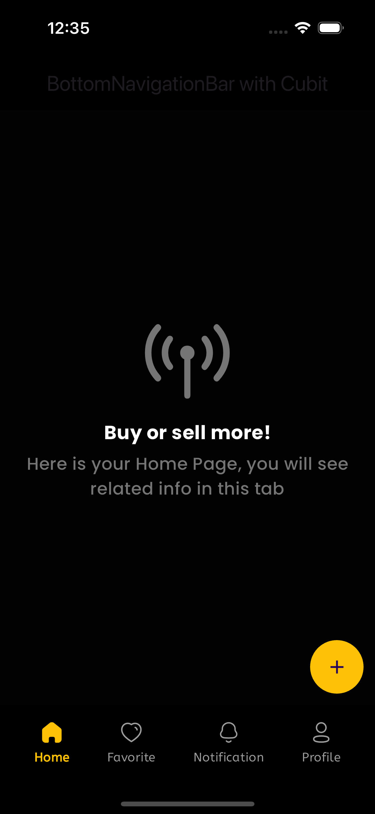

# Flutter Bottom Navigation Bar with Cubit

This is a Flutter project that demonstrates the implementation of a Bottom Navigation Bar using the Cubit state management approach from the `flutter_bloc` package.

## Features

- Bottom Navigation Bar with four pages: Home, Favorite, Notifications, and Profile.
- Smooth page transitions when navigating between pages.
- Floating Action Button (FAB) to trigger a SnackBar.
- App Bar with a title.
- State management using Cubit from the `flutter_bloc` package.

## Screenshots/DEMO

## Getting Started

1. Clone the repository or download the source code.
2. Open the project in your preferred IDE (e.g., Android Studio, Visual Studio Code).
3. Run the app on an emulator or physical device.

## Dependencies

This project uses the following dependencies:

- `flutter_bloc`: A Flutter Widgets that make it easy to implement the BLoC (Business Logic Component) design pattern.
- `google_fonts`: A Flutter plugin to use the latest Google Fonts.
- `iconly`: A Flutter Icons library with over 350+ icons.

## Contributing

Contributions are welcome! If you find any issues or have suggestions for improvements, please open an issue or submit a pull request.

## License

This project is licensed under the MIT License. See the [LICENSE](LICENSE) file for more details.
